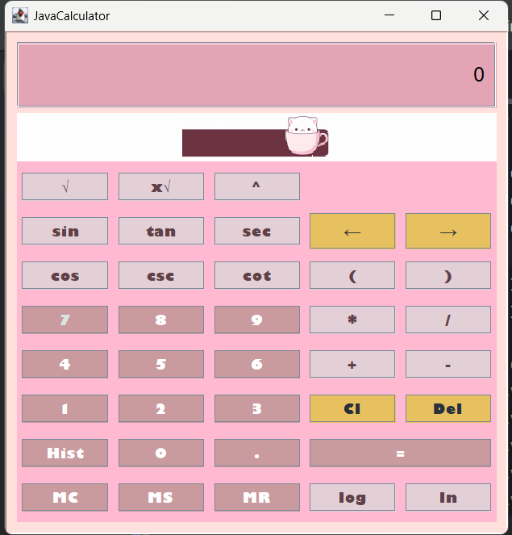

# Scientific Calculator with History (SciCal Java)

This is a simple scientific calculator built using Java and a GUI form in Swing. It supports basic arithmetic operations, advanced mathematical functions (e.g., `sin`, `cos`, `tan`, `log`, `sqrt`), memory operations, and calculation history. This project was developed as a final project for the Object-Oriented Programming (OOP) course by a Computer Science student at New Era University.

## Setup Instructions

### Option 1: Run from Source Code
1. Clone the repository to your local machine:
   ```bash
   git clone https://github.com/BaiSakinaAbad/SciCal_java_whistory.git
   ```
2. Navigate to the project directory and switch to the `sakina` branch:
   ```bash
   cd SciCal_java_whistory
   git checkout sakina
   ```
3. Ensure you have Java 24 installed on your system.
4. Run the application from the source code:
   - Navigate to `src/calculator/ui/`.
   - Compile and run `JavaCalculator.java`:
     ```bash
     javac JavaCalculator.java
     java JavaCalculator
     ```
   - Alternatively, if using an IDE like IntelliJ IDEA, open the project and run `JavaCalculator` directly.

### Option 2: Run Using the JAR File
1. Ensure you have Java 24 installed on your system.
2. Download the JAR file from `out/artifacts/JavaCalculatorWhistory_jar/JavaCalculatorWhistory.jar` in this repository.
3. Run the JAR file:
   ```bash
   java -jar JavaCalculatorWhistory.jar
   ```

## System Requirements
- **Java Version**: Java 24 is required to run this application. Ensure it is installed and properly configured on your system.
  - To check your Java version:
    ```bash
    java --version
    ```
  - If Java 24 is not installed, download it from [Oracle's official website](https://www.oracle.com/java/technologies/downloads/) or use a package manager like `sdkman`.

## Project Context
This scientific calculator is a final project for the Object-Oriented Programming (OOP) course, completed as part of the Computer Science curriculum at New Era University. The project demonstrates the application of OOP principles such as encapsulation, polymorphism, and inheritance, using Java and Swing for the GUI.

## Features
- Basic arithmetic operations: addition, subtraction, multiplication, division.
- Advanced mathematical functions: `sin`, `cos`, `tan`, `log`, `ln`, `sqrt`, `nrt`, `csc`, `sec`, `cot`.
- Memory operations: store, recall, clear, and add to memory.
- Calculation history: view past calculations in a dialog.
- User-friendly GUI built with Java Swing and a form.

## Preview Screenshot
Below is a preview of the calculator's interface. 


## Acknowledgments
- Developed by Bai Sakina Abad as part of the OOP course at New Era University.
- Built using Java Swing for the GUI and Maven for project management.